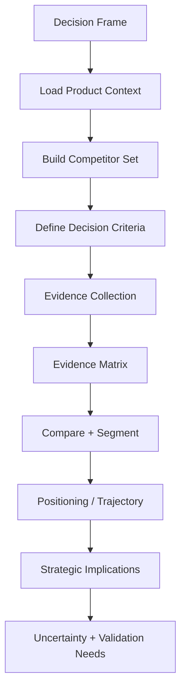

# 竞争决策框架与 Evidence Matrix

在正式竞争分析开始后读取，用于 Decision Frame、竞争集合、比较维度、来源策略和 Evidence Matrix。

# 核心原则

## 1. Decision Frame First

先确定这次分析服务于什么决策。

常见 Decision Frame：

- 产品定位：我们应该占据什么位置？
- 产品路线：哪些能力值得补，哪些不值得追？
- Go-to-market：应该争取哪类客户？
- 定价：竞争压力来自价格、价值还是商业模式？
- 销售：客户为什么选我们、选对手或继续维持现状？
- 投资/进入市场：竞争是否已经过度拥挤？

同一组竞品数据，对不同决策可能产生不同结论。不要在没有决策语境时输出泛化 SWOT。

## 2. Evidence Before Judgment

每个重要竞争判断都应能追溯到证据，并区分证据类型：

- `first-party fact`：官方文档、定价、产品页面、Changelog、公开合同/公告直接支持；
- `vendor claim`：厂商这样宣传，但尚未独立验证；
- `observed evidence`：实际产品、公开 Demo、可验证行为或数据；
- `customer/community evidence`：真实用户评论、论坛、Issue、评测中的体验信号；
- `independent evidence`：可信第三方数据、研究或分析；
- `inference`：基于已验证事实得出的分析判断；
- `unknown`：当前证据不足。

不要把营销口号直接写成能力事实，也不要把一个高赞帖子写成整体市场共识。

## 3. Comparable by Design

比较多个对象时，尽量使用：

- 相同时间窗口；
- 相同定义；
- 相同研究深度；
- 相同维度；
- 相近来源质量。

如果 A 有完整资料、B 只能查到少量旧资料，必须把 `evidence asymmetry` 写出来，不能把“资料少”误判成“能力弱”。

## 4. Honest Competitor Assessment

竞争分析的价值来自准确，不来自替自己赢辩论。

必须：

- 明确承认竞争对手真实优势；
- 明确承认自己的劣势和适用边界；
- 不编造对手缺失的功能、差评、价格或客户流失；
- 不把“官网没写”自动等同于“没有”；
- 不把“我们计划做”写成“我们已经具备”；
- 不用虚假的绝对评价，如“全面领先”“碾压”，除非证据真的能支持。

## 5. Status Quo Is a Competitor

真实购买决策经常不是“我们 vs 另一个 SaaS”，而是：

- 继续手工做；
- Excel / Notion / 邮件 / 通用工具；
- 内部自研；
- 找代理商或外包；
- 维持旧系统；
- 什么也不做。

如果这些选项会真实吸收用户预算或阻止切换，就应该进入 Competitor Set。

## 6. Strategy Must Follow Evidence

“市场机会”至少需要考虑三件事：

1. 客户是否真的在乎这个问题；
2. 竞争方案是否真的没有很好解决；
3. 我方是否有现实能力或路径去占据这个位置。

只看到“竞品没做”不能直接得出“这是机会”。它可能只是没人需要。

---

# Workflow

## Phase 1 — Decision Frame

先明确：

- 被分析的“我们 / 主体”是谁；
- 这次要支持什么决策；
- 目标客户 / 市场范围；
- 地域和时间范围；
- 已知竞争对手；
- 用户最关心的维度。

信息足够时直接执行，不为了填模板重复询问。

## Phase 2 — Load Product Context

如果**当前真实业务工作区**存在 `.agents/product-marketing.md`，读取并使用其中已经确认的：

- Product Overview；
- Target Audience / ICP；
- Problems & Pain Points；
- Competitive Landscape；
- Differentiation；
- Objections；
- Customer Language；
- Proof Points。

遵守其中 Evidence Status。`inferred / unknown` 不能升级成 confirmed fact。

不要把 Skill Runtime 自身目录中的文件当成用户公司的业务 Context，也不要因为本文件支持 Product Marketing Context 就自动创建或更新它。

## Phase 3 — Build the Competitor Set

不要只接受用户脑海中的品牌名单。先判断竞争类型：

| Type | Meaning |
|---|---|
| Direct | 同类产品、相近客户、解决相近问题 |
| Adjacent / Secondary | 用不同产品形态解决同一核心任务 |
| Substitute | 另一种工作方式或服务能达到相近结果 |
| Status quo | 继续手工、自研、旧系统或不改变 |
| Emerging | 目前规模有限，但路线可能改变竞争结构 |

只纳入与 Decision Frame 相关的对象。SEO 搜索结果相邻、媒体经常一起提及，并不足以证明是实际竞争对手。

## Phase 4 — Define Decision Criteria

比较维度必须来自**客户的真实选择标准和本次决策**，而不是机械功能清单。

常见维度包括：

- 核心任务完成能力；
- Time to Value / 易用性；
- 控制力与可定制性；
- 集成和生态；
- 价格与 Total Cost of Ownership；
- 服务、实施和运营负担；
- 可靠性、安全、合规或信任；
- 目标客户和购买流程；
- 数据/内容/工作流锁定与切换成本；
- 社区、开发者或合作伙伴生态；
- 产品发展速度和方向；
- 商业模式与渠道。

只选真正影响当前决策的维度。

### 关于权重

只有当用户明确需要定量决策或权重有真实依据时才使用加权评分。

如果没有可靠权重：

- 不编造 30% / 20% / 10% 权重；
- 不生成伪精确的 8.7/10 总分；
- 使用定性比较和适用条件。

## Phase 5 — Evidence Collection

可以使用用户现有材料，也可以在当前环境具备检索能力且任务需要最新事实时做外部研究。

按维度选择合适来源：

### 产品与能力

优先：

- 官方文档；
- 产品页面；
- Changelog / release notes；
- 可验证 Demo / 产品行为；
- 官方仓库；
- 真实用户关于能力边界的反馈。

### 价格与商业模式

优先：

- 当前官方 Pricing；
- 合同/套餐说明；
- 使用量、席位、附加费等计费规则；
- 企业版隐藏价格只能标记为 unknown / contact sales，不能猜。

价格必须记录观察日期；不要拿不同年份的价格直接并排。

### 客户体验

可使用：

- Reddit / HN / GitHub Issues；
- G2、Capterra、TrustRadius 等评论；
- 客户案例；
- 社区论坛和公开反馈。

把官方 Case Study 当作 vendor-selected evidence；把社区评论当作样本信号，不把任一来源机械视为全体用户。

### 市场与公司信息

根据问题选择：

- 官方公告 / filings；
- 可信行业数据；
- 专业媒体；
- 招聘、Changelog、公开 roadmap 等方向信号。

如果当前环境没有上游所依赖的 Firecrawl、DataForSEO 或其他专用数据源，直接使用可用的等价证据；缺失的 SEO、流量、backlink 等指标保持 unknown，**不编造**。

## Phase 6 — Evidence Matrix

建立统一的 Evidence Matrix。推荐结构：

| Dimension | Us | Competitor A | Competitor B | Evidence / Date | State |
|---|---|---|---|---|---|
| Target ICP | ... | ... | ... | sources | confirmed / inferred / unknown |
| Pricing | ... | ... | ... | official pricing, date | first-party fact |
| Time to value | ... | ... | ... | docs + user reports | mixed |

同时维护重要 Claim 的来源属性。

### Comparison States

可使用：

- `proven advantage`：证据清楚且对决策重要的优势；
- `likely advantage`：证据方向一致，但仍有缺口；
- `parity`：没有实质性可验证差异；
- `trade-off`：双方优势服务于不同偏好；
- `likely disadvantage`：有可靠证据表明处于劣势；
- `unknown`：证据不足。

不要把每一行都强迫产生赢家。

## Phase 7 — Compare, Segment, and Identify Trade-offs
