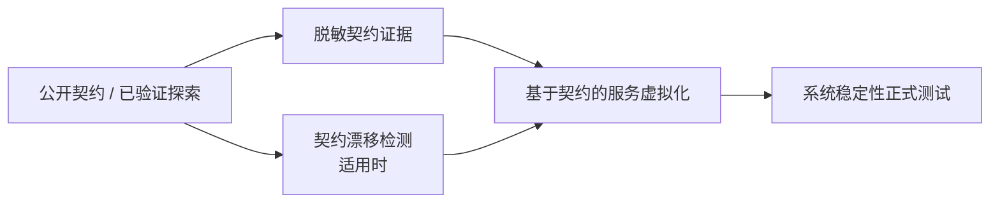

# 项目研发协作公共决策与证据规范

本规范供 GitHub 调研、讨论、结论、开发计划、缺陷调查、技术测试方案、业务测试方案与测试方案审计 Skill 共享。各 Skill 的专项规则可以更严格，但不得削弱本规范。

当前 `development` Category 负责研发前置分析、计划与质量设计；实际生产代码实现、测试代码编写和完整真实环境验证由下游 Coding/Test Agent 完成。

## 0. 中文优先表达

面向用户、GitHub Issue、评论和交付文档时默认使用中文。能用中文准确表达的概念优先使用中文，避免为了显得专业而堆叠英文名词。

以下内容可以保留原文：代码标识符、字段名、函数名、文件路径、命令、协议/标准名、已经冻结的专有术语，以及用于避免歧义的必要英文原词。

常见通用概念在新写内容中直接使用中文，例如“当前实现”“目标方案”“差距”“流程图”“时序图”“决定/决策”“发现项/问题项”“完整性检查”“审查”“结论”“开发计划”。

如果引用的历史材料本身使用英文标题，可以在来源引用中保留原文；新写的 Issue、评论、图表节点、表头和面向用户的解释仍优先使用中文。

内部代码化状态、ID 或字段可以保留英文，但对用户解释时优先补充中文含义。

### 0.1 GitHub Issue 标题前缀

`development` 新创建的正式 GitHub Issue 只使用以下前缀：

- `【讨论】<主题>`：尚未定案，需要沟通和决策；
- `【调研】<主题>`：系统性调查当前实现、调用链、事实和缺口；
- `【结论】<主题>`：把已经确认的讨论/调研结果和高传播合同冻结为权威输入；
- `【实施计划】<交付目标>`：给下游 Coding Agent 的严格开发执行合同；
- `【技术测试方案】<范围>`：测试层级、Harness、Fixture、Reset、自动化、E2E/Resilience、Evidence 等技术测试设计；
- `【业务测试方案】<业务目标>`：业务理解、Expected Contract、Feature/State/Invariant/Scenario/Gherkin 等业务验收设计；
- `【缺陷】P0|P1|P2|P3 <故障标题>`：已经有证据确认的真实生产缺陷。

这是唯一命名集合。新写 Issue 不保留旧前缀别名、不做双写、不为历史命名增加兼容分支。内部 Skill ID、状态字段和 handoff 本地 ID 可以继续使用稳定程序标识，不属于用户可见标题前缀。

## 1. 证据优先

凡是涉及当前实现、影响范围、文件位置、调用链、状态归属、数据库写入、外部依赖、工作量或测试范围的判断，必须优先使用用户提供的当前源码、日志、测试、截图和附件。

访问项目源码时读取根目录及适用子目录的 `AGENTS.md`。Issue、讨论、文档和历史记录可以补充上下文，但不能替代当前源码证据。

结论必须区分：

- `verified_fact`：当前材料可以直接证明；
- `user_decision`：用户已经明确选择；
- `inference`：由证据推导，但不是直接事实；
- `assumption`：待验证；
- `deferred`：明确延期；
- `out_of_scope`：本轮明确不做。

证据不足时降低结论强度，不用经验、记忆或“通常应该如此”补齐当前实现。

## 2. 决策门

模型可以自行确定不会改变产品语义、系统职责、持久化语义、外部契约或用户体验的普通实现细节；以下内容属于高影响决策，缺少已有决定时不得代替用户选择：

- 模块或服务职责归属；
- 状态所有权和推进时机；
- 数据模型、持久化语义和迁移策略；
- 对外接口 / 事件 / schema / 错误契约；
- 同步与异步边界；
- 用户可见行为、失败行为和恢复语义；
- 外部系统交互边界；
- 安全、权限和审计策略；
- 会显著扩大交付范围的新平台能力或基础设施。

遇到未决定的高影响事项时：

1. 明确标记 `DECISION_REQUIRED`；
2. 说明证据、影响和可选方案及权衡；
3. 停止受该决定影响的分析/设计/计划分支；
4. 仍可继续推进与该决定无依赖的分析或任务；
5. 不通过“先按合理默认值做”绕过决定。

下游 Skill 必须继承上游已确认决定，不能在没有新证据或用户授权的情况下二次设计。

## 3. 范围门与防需求扩散

提出方案或任务前区分：

- `existing_capability`：源码已存在；
- `requested_change`：用户本轮明确要求；
- `new_requirement`：当前不存在且用户未提出。

如果某条方案依赖 `new_requirement`，只指出该依赖和影响，不继续设计它的内部结构，除非用户明确把它加入范围。

禁止为了追求“架构完整”自动增加队列、Worker、调度器、状态机、缓存、抽象层、数据模型、平台服务或额外生命周期。

## 4. 外部系统所有权边界

先判断资源是否由当前项目拥有。

### 项目拥有

当前项目拥有的数据、运行资源和测试资源，可以在授权范围内创建、修改、故障注入和清理，并要求 precise cleanup。

### 外部系统拥有

外部服务只通过其公开契约交互。默认禁止：

- 直接连接或修改外部系统数据库；
- 使用外部系统私有 env / 内部管理口完成测试；
- 依赖外部系统内部表结构、任务实现或私有状态；
- 为了稳定测试而绕过公开契约 注入内部状态；
- 通过私有能力清理外部系统数据。

如果测试通过外部服务的**公开契约**创建了专属于本次测试的资源，且 Provider 明确支持安全删除，可以通过同一公开契约 做 受限清理；如果不支持，优先使用 沙盒 / 测试租户、unique namespace、TTL 或 服务提供方提供的测试生命周期，不能越过 所有权边界。

技术测试方案中的系统稳定性测试，对外部服务提供方的推荐路径：



抓取/回放可以作为契约证据或服务虚拟化实现，但历史录制样本 本身不能永久替代当前契约。长期外部替身适用时应有 服务提供方验证、契约测试、schema 检查、受限实时探测或时效策略 来发现 契约漂移。

只有测试目标明确就是“实时外部集成”且用户/计划明确要求时，才把 实时外部调用 作为 正式测试依赖；即使如此也只能通过公开契约 操作和清理测试资源，不能要求外部系统内部 DB cleanup。

## 5. 图表继承与真实性

跨步骤、跨模块、跨服务、状态推进、异步或失败恢复场景优先使用 Flowchart / Sequence Diagram。

- 当前实现图只表达已验证的当前实现；
- 目标方案图只表达已确认决定；
- 下游结论 / 开发计划应继承上游已确认的目标图和差距，不重新发明另一套设计；
- 决策改变调用链、职责、状态、顺序或失败语义时才更新目标方案图；
- 图、正文和决策记录冲突时必须修正，不能保留过期图作为现行设计。

## 6. 穷尽式审计

当任务是审查、完整性检查、测试方案审计、实现评估或缺陷盘点时，默认目标是找出**所有有证据支持且属于当前范围的独立发现项**，不人为截断为 Top 3 / Top 5 / “主要问题”。

可以为了可读性分批输出或分评论记录，但必须：

- 保留稳定发现项 ID；
- 同根因去重；
- 不同根因独立记录；
- 明确搜索覆盖和未检查边界；
- 未完成覆盖时不能声称“审查完整”。

## 7. 复杂度 Gate 与 Patch Fast Lane

复杂度同时控制**输出粒度与研发流程路由**，不能只当文档篇幅标签。

- `S`：局部、低传播、责任边界清楚，无数据/外部契约/复杂生命周期；
- `M`：常规跨文件或跨层修改，存在需要显式拆解的传播范围；
- `L`：跨模块/服务、数据迁移、状态机、并发、外部契约、安全权限或其它高风险变更。

### S 级 Patch Fast Lane

只有根因/目标行为已确认，并且以下条件都成立时，才标记 `patch_fast_lane_eligible`：

- 没有 `DECISION_REQUIRED` 的产品/架构/用户体验选择；
- 不改变模块/服务职责、状态所有权、同步/异步边界；
- 不涉及数据模型、迁移或持久化语义；
- 不改变外部 API / RPC / event / schema / error contract；
- 不涉及复杂状态机、并发、幂等、生命周期或高风险安全权限语义；
- 编辑点和影响面能由当前源码证据限定在局部范围；
- Patch 回放与当前环境可做的局部验证边界明确。

全部成立 → 可进入 `development/source-patch-implementation` 直接实施并交付 `.patch`。

任一条件不成立 → `patch_fast_lane_blocked`。根因未明继续缺陷调查；高影响合同未定进入讨论；需要冻结高传播合同进入 Spec；M/L 且目标已明确进入实施计划。用户点名“直接 patch”不豁免 Gate，也不能把 M/L 人为降成 S。

适用项必须完整，不适用项可以明确省略。不要给没有迁移的任务制造迁移，也不要给没有长期运行信号的局部任务制造可观测性。

## 8. 跨技能状态继承

推荐链路：

```text
源码/证据调查
→ 【讨论】决策冻结（需要决策时）
→ Spec Gate
   ├─ required → 【结论】明确目标行为与验收边界
   ├─ not_required → 记录 spec_not_required + 理由
   └─ undetermined → 返回调查 / 讨论补齐
→ 复杂度 Gate
   ├─ S + patch_fast_lane_eligible + 用户要直接修改 → Source Patch Implementation
   └─ M/L 或 Fast Lane blocked → 根据目标形成【实施计划】/【技术测试方案】/【业务测试方案】
→ S 级 Patch 在当前 Runtime 做局部实施/回放验证；M/L 由下游 Coding/Test Agent 在真实环境实施与验证
→ 执行证据返回后进入调研 / 缺陷 / 测试方案审计
```

原则：

- 上游负责产生决定，下游负责消费决定；
- 结论是高传播合同的冻结层；局部低传播变更可以经过 Spec Gate 后明确跳过；
- `ready_for_spec` 不能被实施计划、技术测试方案或业务测试方案静默绕过；用户明确选择跳过时记录 `spec_skipped_by_user` 和风险边界；
- 如果下游发现新证据使既有决定失效，回到对应决策层，不在下游静默改设计；
- 新发现的独立缺陷单独记录；
- 局部阻塞只阻塞受影响子图，其他无依赖工作继续。


## 9. 旁路缺陷捕获

研发主任务在读取源码、测试、日志、截图、Patch 或运行证据时，如果顺手发现已经有证据支持的独立生产缺陷，不得因为“当前主要在做调研/讨论/审计/计划”而忽略。`development/github-incidental-bug-capture` 是 `visibility: internal` 的内部组合能力，不参与用户主任务路由。

统一处理：

1. 保持当前主 Skill 不变；
2. 一旦满足“已确认独立生产缺陷”条件，必须加载 `development/github-incidental-bug-capture`；
3. 冻结最小充分证据；
4. 查重开放与已关闭 Issue；
5. 同根因开放项补证、同根因关闭项复发优先重开、不同根因新建；
6. 记录完成后继续与该 Bug 无依赖的主任务；
7. P0、安全/隐私、数据破坏或会污染后续结论时，只阻塞受影响范围。

只有以下情况不自动报生产缺陷：当前能力未实现、需求/合同未定、纯文档漂移、测试/Harness/环境问题、纯维护建议或证据不足的可疑点。**不自动报缺陷 不等于可以静默忽略**：只要该发现对用户当前任务有实质影响，就必须在原主任务输出中按真实类别明确报告，并说明现有证据与缺口。

旁路记录默认不授权修复。用户主目标本来就是缺陷调查时继续使用 `development/github-bug-investigation`；根因确认后若满足 S 级 Patch Fast Lane 且用户明确要直接修改，可进入 `development/source-patch-implementation`；M/L 或 Fast Lane blocked 时进入 `development/github-development-plan-generator`，真实实施由下游 Coding Agent 完成。
