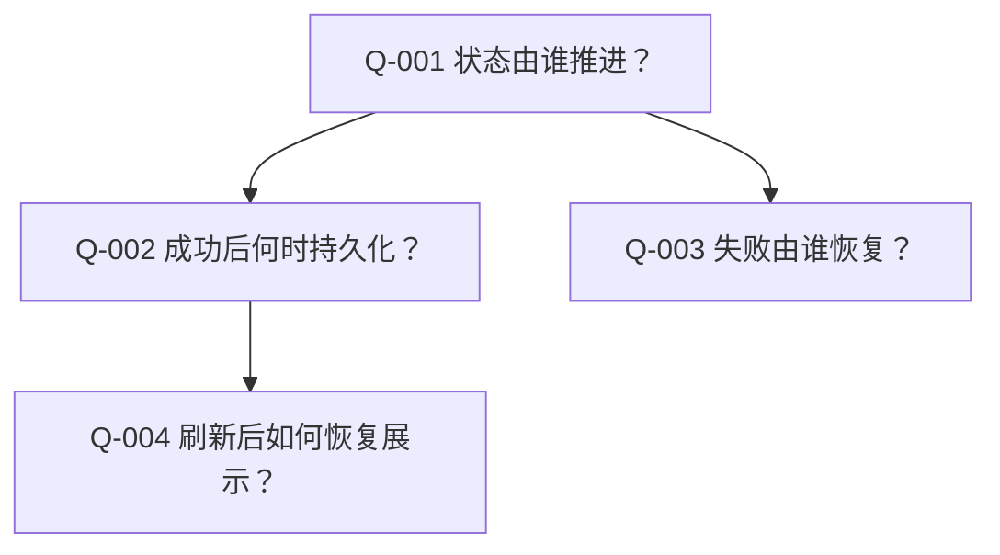
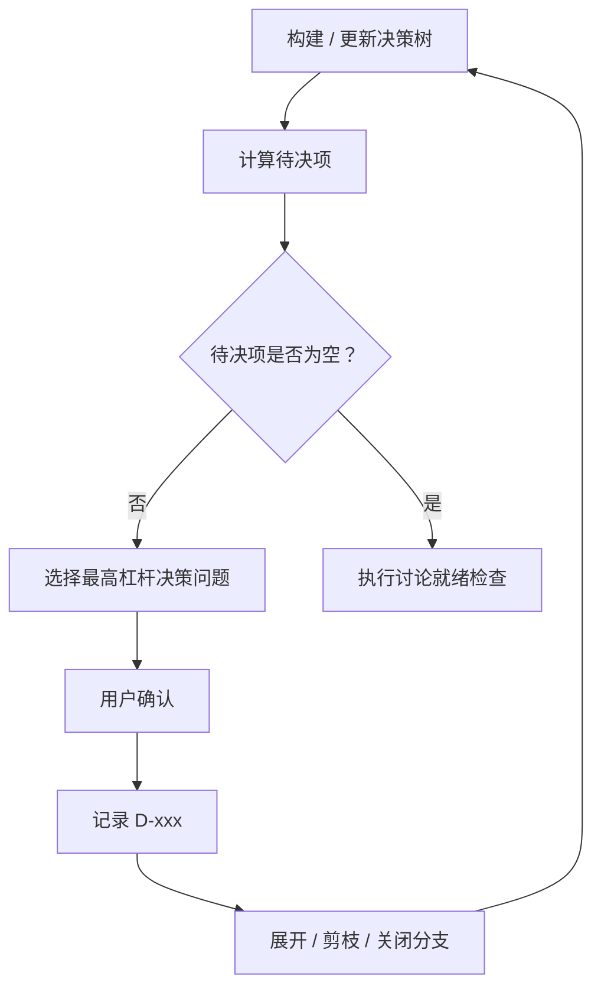

# 讨论证据、范围、决策树与图示

在讨论需要读取源码、建立当前/目标差距、决策树或 Mermaid 图时读取。

## 启动条件

至少明确：

- 目标仓库或本地交接目标；
- 讨论主题；
- 希望达成的决定；
- 已知约束、已有材料和必须保留的边界。

如果主题包含多个相互独立的决策域，可以在同一 Issue 中分阶段讨论；只有交付目标完全独立时才拆分。

## 讨论连续性检查

讨论类 Issue 不使用普通 Bug/Feature 的“同根因即重复”语义。正式开始前判断是不是**同一轮尚未结束的决策过程**：

- 找到仍进行中的同轮讨论：续用原 Issue；
- 找到历史相关但已结束的讨论：创建本轮新 Issue，并引用历史讨论；
- 找到类似标题但目标、触发原因或本轮材料不同：创建新 Issue；
- 未找到：创建新 Issue；
- 无读取能力：生成查重计划和本地讨论载体，标记 `blocked_by_triage`。

不得因为历史上“讨论过类似主题”就错误复用已经结束的旧讨论。

## 源码与证据门

### 何时必须读取源码

只要讨论涉及以下任一问题，在给出具体当前实现结论、改造方案或工作量判断前，必须读取用户提供的当前源码：

- 当前有没有某项能力；
- 当前调用链、状态归属、数据库写入或错误处理如何工作；
- 应该修改哪个模块、接口、表、工作流或组件；
- 是否能复用某个现有能力；
- 某项改造会影响什么；
- 工作量、兼容性或测试范围；
- 当前流程图 / 当前时序图。

访问项目源码时先读取项目根目录和适用子目录中的 `AGENTS.md`。

源码不足时：

- 明确写“当前材料不足以验证”；
- 可以记录待验证假设；
- 不得编造文件、函数、表、接口、服务、状态机或调用链。

### 轻量证据索引

对于会影响设计的关键事实，维护轻量证据编号：

```markdown
### E-001：<事实摘要>
- 类型：源码 / 日志 / Issue / 文档 / 用户确认
- 来源：`<文件路径:行号/符号>` 或 Issue/文档引用
- 证明：<该证据实际支持的事实>
- 状态：verified / partial / pending
```

证据只证明它实际支持的内容，不扩大解释。

## 需求边界与防扩散

提出方案前先做边界检查：

- **现有能力**：源码已存在；
- **本轮明确需求**：用户明确要求实现或改变；
- **新增需求**：当前不存在且用户未提出。

如果某个方案依赖“新增需求”：

1. 明确指出当前系统没有这项能力；
2. 说明它为什么超出本轮范围；
3. 不继续发散该能力的内部设计，除非用户明确把它加入本轮讨论。

不要为了追求“架构完整”主动引入新的队列、Worker、调度器、状态机、缓存、抽象层、数据模型或平台能力。

## 决策树与待决项

决策型讨论必须显式维护 **决策树（决策依赖树）** 与 **待决项**，用结构约束讨论顺序和完整性。这里的决策树 只记录可共享的决策节点、依赖、分支和状态，不记录隐藏推理过程。

### 决策树

决策树只表达会影响本轮目标的真实决策节点、依赖和分支，不记录模型的内部思维过程，也不为了“显得完整”拆出大量微小问题。

每个节点至少包含：

- 节点编号：`Q-xxx`；
- 决策问题：用户实际需要确认什么；
- 前置依赖：依赖哪些 `Q-xxx` / `D-xxx`；
- 生命周期状态：`unresolved / resolved / pruned / deferred / blocked`；
- 待决项：是否属于当前可提问集合（派生状态，不作为独立生命周期状态）；
- 影响范围：它会改变哪些目标方案、差距、流程、状态或契约；
- 结论引用：解决后指向对应 `D-xxx`。

构树规则：

1. 先从本轮目标、已知约束和源码事实中识别真正需要用户选择的决策；
2. 能通过源码、日志、文档或工具调查得到的事实，不作为决策问题反问用户；先完成调查，再展开受事实影响的决策节点；
3. 如果某问题的有效选项取决于另一个尚未解决的问题，建立依赖，不提前询问；
4. 用户的回答使某些分支失效时，将对应节点标记为 `pruned`，不继续追问；
5. 用户明确延期且不阻塞本轮目标时标记 `deferred`；会阻塞时不能假装待决项 已清空；
6. 新发现的问题如果属于本轮范围，加入树并重新计算待决项；如果属于新增需求，按“需求边界与防扩散”处理，不向树中无限扩展。

决策树能用 Mermaid 表达时，正文必须使用 Mermaid，例如：



节点内容必须是可共享的决策摘要，不写隐藏推理。

### 待决项

待决项是“**当前可以安全提问、且前置条件已经解决的未决决策节点集合**”。

一个节点进入 待决项，至少满足：

- 节点仍是 `unresolved`；
- 所有前置决策已经 `resolved`，或其依赖分支已明确生效；
- 所需事实已经验证到足以做决定；
- 节点没有因上游决定被 `pruned`；
- 节点属于本轮范围。

正文中的待决项 建议维护为轻量表，只展示当前可回答节点，不重复整棵树：

```markdown
| Q | 决策问题 | 前置条件 | 推荐 | 影响范围 |
|---|---|---|---|---|
| Q-003 | <问题> | D-001 | <推荐摘要 / 暂不推荐> | <目标方案/差距/状态/契约> |
```

推进规则优先用 Mermaid 表达：



待决项为空只代表“当前树上没有可继续提问的节点”。结束讨论前仍必须执行讨论就绪检查，确认不存在漏建节点、被错误延期的阻塞项或当前实现/目标方案/差距 不一致。

## 当前实现 / 目标方案 / 差距

涉及现有系统改造时，讨论正文必须逐步形成以下三层：

### 当前实现

当前系统实际行为，只能由源码、日志、已验证 Issue/文档或用户明确提供的现状事实支撑。

### 目标方案

本轮希望达到的行为，只能由已经确认的 `D-xxx` 决策支撑。未确认建议不能进入目标方案。

### 差距

当前实现到目标方案需要改变的职责、数据、调用、状态、异常行为或测试边界。差距描述“需要变化什么”，不把计划中的修改写成已经完成。

建议维护差距表：

```markdown
| 差距 | 当前实现 | 目标方案 | 决策 | 状态 |
|---|---|---|---|---|
| G-001 | <现状> | <目标> | D-002 | open |
```

## 图表优先规则

### 图示媒介优先级：优先使用 Mermaid

所有需要画图的内容先判断是否能用 Markdown Mermaid 准确表达：

1. **可以表达且可读**：必须使用 Mermaid；
2. **Mermaid 可以勉强表达，但会明显扭曲语义或降低可读性**：允许改用文本图，并说明为什么 Mermaid 不合适；
3. **Mermaid 无法表达**：使用文本图；
4. 不得因为 Mermaid 编写稍复杂、文本图更快，就直接使用 ASCII / Unicode 图。

常见优先映射：

| 内容 | Mermaid 优先类型 |
|---|---|
| 业务/系统流程、条件分支 | `flowchart` |
| 调用顺序、跨参与者交互 | `sequenceDiagram` |
| 状态与状态迁移 | `stateDiagram-v2` |
| 决策依赖 / 决策树 | `flowchart` |
| 数据实体关系 | `erDiagram` |
| 类/模块静态关系 | `classDiagram` |
| 时间线 / 阶段推进 | `timeline`（载体支持时）或 `flowchart` |

如果 GitHub 或目标 Markdown 载体对某种 Mermaid 语法支持不稳定，优先选择受支持且语义最接近的 Mermaid 类型；只有仍无法清楚表达时才退回文本图。

### 图表职责

- **流程图**：表达业务/系统流程如何推进、条件如何分叉、成功和失败在哪里结束；
- **时序图**：表达参与者之间谁调用谁、先后顺序、状态何时写入、成功/失败如何返回；
- 两类图表达的问题不同，不能互相替代。

### 强制画图条件

满足以下任一条件时，正文必须包含对应 Mermaid 图：

| 讨论内容 | 最低要求 |
|---|---|
| 3 个及以上有意义处理步骤 | Flowchart |
| 前端 + 后端协作 | 流程图 + 时序图 |
| 跨模块 / 跨服务调用 | 流程图 + 时序图 |
| 涉及外部系统 | 流程图 + 时序图 |
| 异步任务 / 工作流 | 流程图 + 时序图 |
| 状态推进或状态所有权 | 流程图 + 时序图 |
| 数据库关键状态写入时机 | 在时序图中体现 |
| 失败、补偿、恢复、重试语义 | 图中必须包含异常路径 |
| 当前实现 → 目标方案 改造 | 当前实现图 + 目标方案图 |
| 纯产品规则、文案、单点配置 | 图可选 |

### 当前实现 图与 目标方案图

涉及当前实现 → 目标方案改造时：

- `当前流程图` / `当前时序图` 标题必须明确“当前实现（基于已验证证据）”；
- `目标流程图` / `目标时序图` 标题必须明确“目标设计（基于已确认 D-xxx）”；
- 当前实现图中不得出现源码尚未证明存在的组件；
- 目标方案图中不得出现尚未确认的设计建议；
- 不能用一张图把当前实现和目标方案 混在一起，以免后续 AI 把计划误认为现状。

### 图表真实性

图中每个有业务含义的节点、参与者、状态或调用都必须有来源：

- 当前实现：对应 `E-xxx` 或用户明确提供的现状事实；
- 目标方案：对应 `D-xxx`；
- 待验证内容必须明确标记，不能伪装成已知事实。

图表以准确和可读为先，不为了“完整”增加无证据节点。

### 图表更新

当新的决定改变以下任一内容时，必须同步更新正文中的 目标方案图：

- 调用链；
- 参与者职责；
- 状态归属；
- 执行顺序；
- 数据写入时机；
- 成功、失败、恢复或退出条件。

旧决策被替代后，不能让旧图继续作为当前目标方案。
