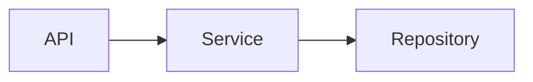

# 调研文档引用规范

## 1. 引用目标

引用解决三个问题：

1. 这句话依据什么；
2. 来源能否被下一位读者/AI 快速定位；
3. 来源实际能证明到什么程度。

完整来源统一放在文末，正文仅用数字编号 `[N]`。

## 2. 来源 ID 分配

同一个来源在同一文档中保持同一编号。来源“粒度”按可独立定位和可独立证明的事实划分：

- 同一源码文件的不同 symbol 如果证明完全不同的事实，可以拆不同编号；
- 同一 symbol 支撑多个相近事实可以复用同一编号；
- 一个超大文件不能只用一个编号笼统支撑整篇文章。

## 3. 正文示例

```markdown
`existing_site` profile 当前调度 6 个岗位，而 `new_site` 只调度 4 个岗位。[3]

`market_priority` 的确定性函数要求 `opportunityScore` 与 `fitScore`，但当前准备上下文时两者均传入 `null`。[8][9]

**推断：** 因此当前正式链路无法依靠该 Rule 形成市场优先级 Candidate。[8][9][11]
```

## 4. 表格

事实表优先增加证据列：

```markdown
| 主题 | 当前实现 | 证据 |
|---|---|---|
| `site_health_lcp` | LCP 阈值已代码化 | [12][13] |
| `site_health_content` | 只做 Evidence 可用性判断 | [13] |
```

不要用表格上方一句“依据源码”覆盖几十行互不相同的事实。

## 5. Mermaid

图下做节点/边映射：

````markdown


> 图证据：A→B [4]；B→C [6]。
````

如果整张图都由一个明确的 workflow definition 直接定义，可以写：

```markdown
> 图证据：完整主链 [7]；失败分支 [8]。
```

## 6. References 条目

### 源码

```markdown
[1] **[源码]** `path/to/file.ts`，symbol：`Class.method()`，基线：`abc123`。支持：<只写实际证明的事实>。
```

### 测试

```markdown
[2] **[测试]** `path/to/file.test.ts`，test：`<test name>`，基线：`abc123`。支持：<测试断言证明的行为>。
```

### 用户需求/确认

```markdown
[3] **[用户确认]** 2026-08-17，本轮对话。支持：<用户明确确认的需求或边界>。
```

### Issue

```markdown
[4] **[Issue]** `#477`，章节/评论：`<可定位标题>`，读取日期：2026-08-17。支持：<该 Issue 实际记录的要求/历史>。
```

### 日志

```markdown
[5] **[日志]** `server.log`，时间：`2026-08-17T01:02:03Z`，事件/关键字：`http.request.failed`。支持：<实际观测到的错误>。
```

### 外部网页

只有用户明确要求外部调研时使用：

```markdown
[6] **[外部资料]** <机构/页面标题>，访问日期：2026-08-17。支持：<事实>。
```

## 7. 禁止做法

- `[1] 根据源码`，但不写路径/symbol；
- 引用一个文件去证明该文件中根本不存在的结论；
- 用历史 Issue 证明当前源码一定如此；
- 用测试名称证明生产代码已经上线；
- 用用户愿望证明当前系统已经实现；
- 为了减少 References，把整个仓库压成一条引用；
- 为了显得严谨，在每个普通词后机械加编号；引用应该覆盖“事实单位”。
