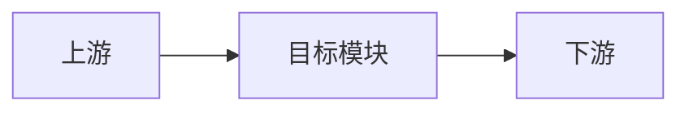
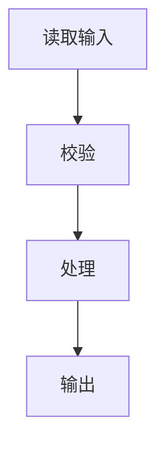
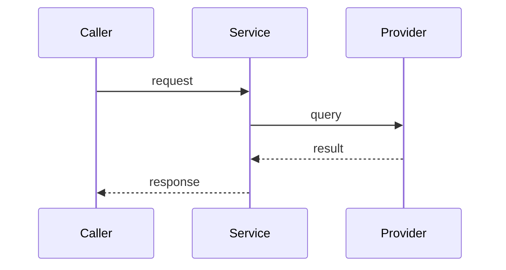

# 调研文档推荐模板

```markdown
# 【调研】<主题>

| 元数据 | 内容 |
|---|---|
| 调研主题 | <...> |
| 基线 | <zip/git/附件> |
| 基线 SHA/HEAD | `<...>` |
| 调研日期 | YYYY-MM-DD |
| 调研范围 | <...> |
| 非目标 | <...> |
| 验证方式 | <静态源码/测试/运行/外部资料> |

## 1. 摘要

用 3～8 个自然段回答：当前实现是什么、核心结论是什么、最重要的边界/缺口是什么。每个事实单位带引用。[1][2]

## 2. 背景与调研问题

### 2.1 背景

### 2.2 本文需要回答的问题

- Q1：...
- Q2：...

### 2.3 范围与非目标

## 3. 关键概念与术语

| 术语 | 含义 | 证据 |
|---|---|---|
| ... | ... | [3] |

## 4. 系统/模块全景



> 图证据：A→B [4]；B→C [5]。

## 5. 入口与输入

### 5.1 入口

### 5.2 输入合同

| 字段 | 类型 | 来源 | 用途 | 证据 |
|---|---|---|---|---|

## 6. 核心处理流程



> 图证据：主链 [6][7]。

### 6.1 第一步：...

### 6.2 第二步：...

## 7. 跨模块/服务调用（适用时）



> 图证据：调用 A→B [8]；B→C [9]。

## 8. 组件/Agent/服务逐项说明

### 8.1 <组件名>

#### 职责

#### 输入

#### 内部处理

#### 输出

#### 失败/降级

#### 当前边界

## 9. 数据、状态与持久化

## 10. 外部依赖

## 11. 输出合同

## 12. 失败、降级与恢复

## 13. 测试与可验证性

| 场景 | 当前测试/验证 | 证据 |
|---|---|---|

## 14. 当前能力与缺口

| 能力/需求 | 当前实现 | Gap | 证据 |
|---|---|---|---|

## 15. 结论

## 16. 真实性边界

- 已验证：...
- 未运行：...
- 未覆盖：...
- 待验证：...

## 参考文献与证据

[1] **[源码]** ...

[2] **[用户确认]** ...
```

模板按任务复杂度裁剪，不适用章节可以省略；任何与调研问题直接相关的重要链路、数据、边界和缺口都不能为了缩短文档而删除。
